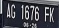
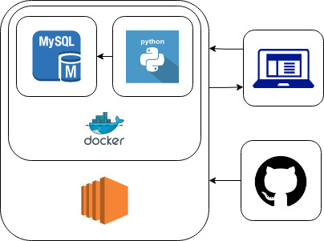
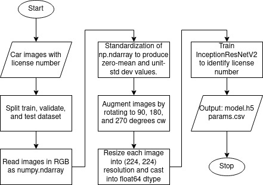
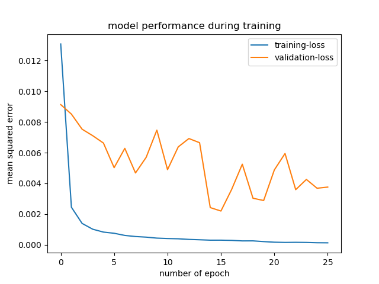
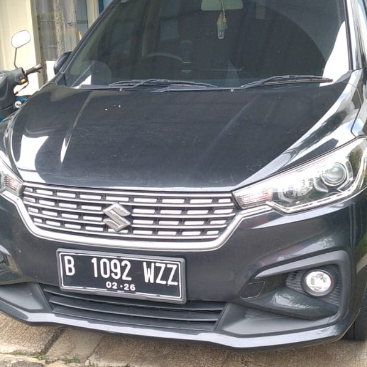
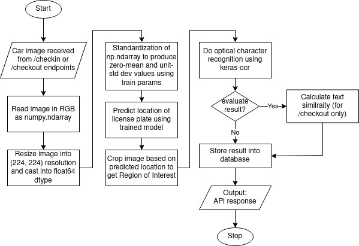

# About the project
<p align="center"></p>
<p align="center"></p>

This application provides REST API for car license number recognition. Sample implementations may include car parking billing system or likewise. In general, this application intends to automatize job/proces of recognizing car license number, in which currently human involvement is arguably high. With such automatization, it may reduce fault due to human-error, improve service in terms of accuracy and time of completion which eventually bring better user experience, and the last, bot not least, to effectively reduce cost.
## Architecture
<p align="center"></p>

Application is built in python. It also communicates with MySQL database to store prediction results. Both python application and MySQL are dockerized and deployed using Amazon Web Service EC2 instance. A github-action based workflow is set up for continuous integration/continuous development. And the deployed service is then serving clients using standard HTTP. Note: secured HTTP communication is currently not supported, but I hope it will be featured in future development.
# Installation
First, clone this repository,
```bash
git clone https://github.com/bagusbpg/pacmann-capstone-project.git
```
Then, set up configuration file, place it in root directory
```json
{
    "DATABASE": {
        "DRIVER": ,
        "HOST": ,
        "PORT": ,
        "USERNAME": ,
        "PASSWORD": ,
        "NAME":
    },
    "APP": {
        "HOST": ,
        "PORT": ,
        "MAXIMUM_IMAGE_UPLOAD_SIZE": ,
        "THRESHOLD_OF_SIMILARITY":
    }
}
```
It is recommended to create new python environment first and then proceed with installing the requirement.
```bash
pip install -r requirements.txt
```
Depending on your machine, you may need to install additional libraries. In case for my Linux computer, I must install `libgl1-mesa-glx`, `ffmpeg`, `libsm6`, `libxext6` and some others for this going to work properly.

Trained model is not included in this repository. I encourage you to work on your own model as it provides more satisfying experience.


Next, initiate your local database. An example of DDL is given in repo directory. I use MySQL by the way. In case you have docker installed, you may run
```bash
docker run -d -p <host-port>:<container-port> --name app_db -e MYSQL_ROOT_PASSWORD=<yourRootPassword> mysql:<tag>
```

Finally, run the application and happy experimenting!
```bash
python ./app/api.py
```
Using docker, you may simply build and run docker image
```bash
docker build -t app .
docker run -d -p <host-port>:<container-port> --name <container-name> <image-name>
```
# How to train a model
<p align="center"></p>

## Training data preparation
- Collect images of cars with license plate for training purpose and place it under /data/images directory. It is better to have images of various brightness, orientation, perspective, scale, sharpness, etc. If you are interested, you may email me at bagusbpg[at]gmail[dot]com and I will share the dataset for training (uploading these huge image dataset to repository is consuming too much space)
- Create `PASCAL Visual Object Classes` for each image, identifying the location of license plate. In case `PASCAL VOC` is created in XML, you may run extractXML.py in data directory to extract `xmin`, `xmax`, `ymin`, and `ymax` coordinates and save them to csv file for later use in training model. Required argument to run this script is path to directory containing images and XML files. <p>NOTE: Beside XML, JSON is also valid format to store `PASCAL VOC`, you may create your own script to do the same thing as extractXML.py.
```bash
python ./data/extractXML.py ./data/images
```
## Training model
- Run train.py in train directory.
```bash
python ./train/train.py
```
- In general, what it does are (1) splitting training, validation, and test for feature-dataset, (2) resize to (224, 224) image shape and augment, i.e. rotating each image 90-degrees, 180-degrees, and 270-degrees clockwise to artificially make dataset four times bigger, (3) preprocessing each image, i.e. channel-wise standardization to make zero mean and unit standard deviation of dataset, (4) save mean and standard deviation of training dataset to be used for inference, (5) splitting training, validation, and test for target-dataset, which comes from extracted Pascal VOC XMLs described earlier, (6) define model, and finally (7) fit the model and save it. Model fitting is equipped with EarlyStopping to prevent overfitting. Following is the plot of metrics (mean squared error) during model training. You may plot your own from automatically-generated train_log.csv.
<p align="center"></p>

# Sample training dataset
For following car image
<p align="center"></p>

The associated `PASCAL Visual Object Classes` is as follow.
```xml
<annotation>
	<folder>1</folder>
	<filename>1-B1092WZZ.jpg</filename>
	<path>final/data/images/1-B1092WZZ.jpg</path>
	<source>
		<database>Unknown</database>
	</source>
	<size>
		<width>600</width>
		<height>600</height>
		<depth>3</depth>
	</size>
	<segmented>0</segmented>
	<object>
		<name>B1092WZZ</name>
		<pose>Unspecified</pose>
		<truncated>0</truncated>
		<difficult>0</difficult>
		<bndbox>
			<xmin>95</xmin>
			<ymin>411</ymin>
			<xmax>296</xmax>
			<ymax>486</ymax>
		</bndbox>
	</object>
</annotation>
```

# How prediction works
<p align="center"></p>

- Trained model is used to predict the location of license plate on car image received via API. In general, the original image is pre-processed similarly to training dataset: (1) it is resized to standard (224x224) shape, (2) standardization using training params (channel-wise mean and standard deviation), (3) predict location of license plate, (4) extend window of predicted location to account for inaccuracy, (5) crop original image to get Region of Interest, (6) read text embbeded in Region of Interest with the help of keras-ocr.
- In case of using /checkout endpoint, it is necessary to compare the resulting text with those stored in database. Comparison is done using character-based text similarity calculation algorithm with certain threshold. Further explanation can be read under Documentation section of /checkout endpoint.
# Documentation
Currently, two main endpoints are provided with one auxiliary endpoint is for health-check.
## /checkin
This path only accepts `POST` requests. Requests should be `form-data` with a key `file` and value containing `image/jpeg` file. User may upload image of car to this endpoint. Any attempt to upload other kind of file or image format may result in client error. An upper limit for image file size is also set, preventing user to abuse the service. An example request using `curl` command is given below.
```bash
curl --location --request POST '<HOST>:<PORT>/checkin' --form 'file=@<PATH-TO-JPG-FILE>'
```
Response uses standard format as in the following example.
```json
{
    "code": 200,
    "message": "licence plate ac-1616-fk-06126 checked in with id 6454887f-1869-46e4-a92a-5c927f1938be"
}
```
In general, this endpoint attempts to recognize the available license plate on uploaded image, then stored it in database, effectively "checking in" a car.
## /checkout
This path expects request and gives response much like `/checkin`, with the same request validation (file type and size). But instead of "checking in" a car, it does the opposite. It tries to match the parsed car license number with those exist in database. Pattern matching allows for unexact match, meaning that it uses character-based text-similarity-calculation algorithm to determine if two text are similar or not based on certain threshold. But, do not worry as it searches for the best match.

An example request using `curl` command is given below.
```bash
curl --location --request POST '<HOST>:<PORT>/checkout' --form 'file=@<PATH-TO-JPG-FILE>'
```
And corresponding response, if successfull, may look like this.
```json
{
    "code": 200,
    "message": "licence plate ac-1616-fk-06126 checked out at Sat Dec  3 15:51:21 2022"
}
```
## /
This path is for health-check purpose only. Accepting `GET`, it requires no request. Executing this `curl` command
```bash
curl --location --request GET '<HOST>:<PORT>/'
```
it will throw following response
```json
{
    "code": 200,
    "message": "service works fine!"
}
```
# Some insights and further development
- My image dataset is of Indonesian cars. What I have observed is that optical character recognition often failed to tell capital O and Q apart. Some other characters suffer from the same problem as well, particularly capital I is often mistook as lowercase l or number 1. Perhaps, Indonesian police department may reconsider of dropping those similar character for their car license number. If not (and most likely they will not), specially trained optical character recognition is needed to tackle this problem.
- Currently, endpoints are developed to satisfy minimum viable product. But of course, it will be a lot nicer to have full CRUD endpoints.
- An integration with proper user interface via frontend application would certainly boost user experience. A secured HTTP is also important to protect communication between client and server.
# Reference
[Inception-v4, Inception-ResNet and the Impact of Residual Connections on Learning](https://arxiv.org/pdf/1602.07261)